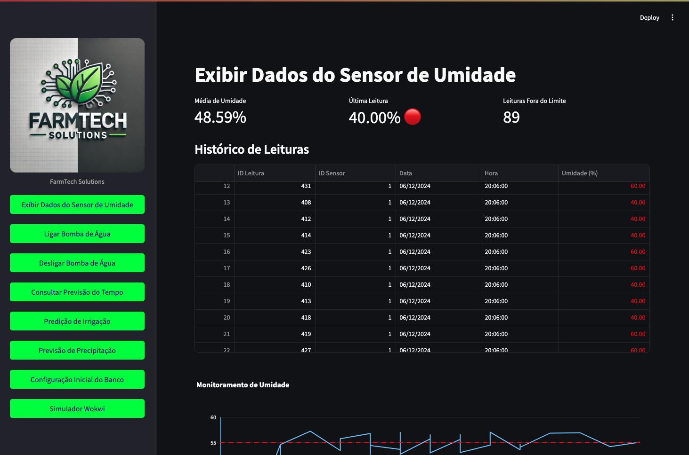
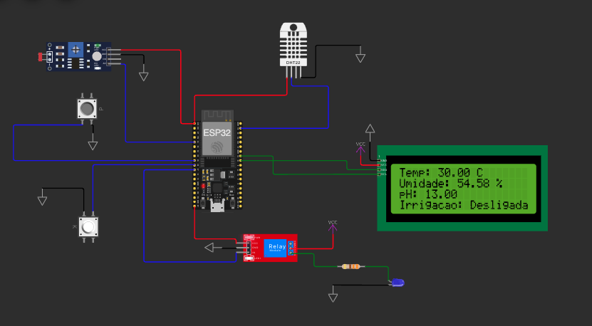

# FIAP - Faculdade de Informática e Administração Paulista

<p align="center">
    <a href="https://www.fiap.com.br/">
        
    </a>
</p>

<br>

# Nome do projeto

```
FarmTech Solutions - Sistema Completo de Automação Agrícola
```

## Nome do grupo

```
TerraFusion Tech - Sistema de Automação de Plantações
```

## 👨‍🎓 Integrantes:

- <a href="https://www.linkedin.com/in/ana-kolodji-94ba66324/">Ana Kolodiji</a>
- <a href="https://www.linkedin.com/in/fernando-segregio/">Fernando Segregio</a>    
- <a href="https://www.linkedin.com/in/matheusconciani/">Matheus Conciani</a> 

## 👩‍🏫 Professores:

### Tutor(a) 
- <a href="https://www.linkedin.com/in/leonardoorabona/">Leonardo Ruiz Orabona</a>
### Coordenador(a)
- <a href="https://www.linkedin.com/in/profandregodoi/">André Godoi</a>

## 📜 Descrição

O **FarmTech Solutions** é um sistema completo de automação agrícola desenvolvido pela equipe TerraFusion Tech. O projeto integra IoT, MQTT, Machine Learning, análise preditiva e dashboard interativo para otimizar a irrigação e monitoramento de plantações através de tecnologias avançadas.

### Funcionalidades Principais:

#### 🌡️ Monitoramento Inteligente em Tempo Real

* **Sensores IoT**: Umidade do solo, temperatura ambiente e pH
* **Dashboard Interativo**: Métricas em tempo real com gráficos dinâmicos
* **Visualização Histórica**: Análise de tendências e padrões
* **Indicadores Visuais**: Status normal/crítico com alertas automáticos
* **Limites Configuráveis**: Umidade (45-55%), Temperatura (12-36°C), pH (6.0-7.5)

#### 🤖 Automação de Irrigação Inteligente

* **Controle Automático**: Ativação baseada em umidade do solo
* **Lógica de Irrigação**: Liga quando umidade < 50%, desliga quando ≥ 50%
* **Comunicação MQTT**: Integração ESP32 com HiveMQ Cloud
* **Controle Manual**: Override manual via dashboard
* **Logs Detalhados**: Histórico completo de ações da bomba

#### 📊 Análise Preditiva e Machine Learning

* **Modelo Preditivo**: Previsão de necessidade de irrigação
* **Análise Climática**: Integração com APIs meteorológicas
* **Previsão 7 dias**: Dados de precipitação e temperatura
* **Sugestões Automáticas**: Recomendações baseadas em IA
* **Otimização de Recursos**: Economia de água e energia

#### 🚨 Sistema de Alertas Avançado

* **Alertas em Tempo Real**: Notificações via email (AWS SNS)
* **Controle de Spam**: Sistema de cooldown configurável (1-60 min)
* **Múltiplos Destinatários**: Gerenciamento de lista de emails
* **Histórico de Alertas**: Armazenamento em banco Oracle
* **Níveis de Criticidade**: INFO, ATENÇÃO, CRÍTICO

#### 🌦️ Integração com APIs Externas

* **OpenWeatherMap**: Dados meteorológicos em tempo real
* **Previsão Climática**: Análise de precipitação
* **Tomada de Decisão**: Baseada em múltiplas fontes
* **Histórico Climático**: Análise de padrões sazonais

#### 🗄️ Banco de Dados Oracle

* **Armazenamento Robusto**: Dados de sensores e alertas
* **Consultas Otimizadas**: Performance para grandes volumes
* **Backup Automático**: Segurança dos dados históricos
* **Relatórios Avançados**: Análises estatísticas detalhadas

## 🖥️ Dashboard da Aplicação



### Sistema de Automação com Display LCD



### Gráfico Suavizado do Serial Plotter


## 📁 Estrutura de Pastas

Dentre os arquivos e pastas presentes na raiz do projeto, definem-se:

* **.github**: Arquivos de configuração específicos do GitHub para automação de processos no repositório.
* **assets**: Arquivos relacionados a elementos não-estruturados como imagens e recursos visuais.
* **config**: Arquivos de configuração para definir parâmetros e ajustes do projeto.
* **document**: Documentos do projeto e atividades. Na subpasta "other", documentos complementares.
* **src/scripts**: Scripts auxiliares para tarefas específicas (deploy, migrações, backups).
* **src**: Todo o código fonte desenvolvido ao longo das 7 fases do projeto.
* **src/fase1**: Análise exploratória de dados e estatísticas básicas.
* **src/fase4**: Dashboard Streamlit com monitoramento em tempo real.
* **src/fase5**: Sistema de alertas e notificações via AWS SNS.
* **src/fase6**: Machine Learning e análise preditiva.
* **PlatformIO**: Arquivos da automação IoT (Wokwi + HiveMQ).
* **logs**: Logs da aplicação em arquivos de texto.
* **README.md**: Guia e explicação geral sobre o projeto.

## 🔧 Como Executar o Código

#### Pré-requisitos

Antes de começar, verifique se você tem os seguintes pré-requisitos instalados:

#### 1. IDEs

* **Visual Studio Code** (ou qualquer IDE de sua preferência)
* **PyCharm** (opcional, para desenvolvimento Python)

#### 2. Serviços

* **Python 3.8 ou superior**: Projeto desenvolvido e testado com Python 3.8+
* **Oracle Database**: Acesso a uma instância do Oracle Database
* **AWS Account**: Para serviços SNS (alertas por email)
* **HiveMQ Cloud**: Broker MQTT para comunicação IoT

#### 3. Bibliotecas

As principais bibliotecas utilizadas (ver `requirements.txt` completo):

* **streamlit**: Interface web interativa
* **pandas**: Manipulação e análise de dados
* **matplotlib/plotly**: Visualização de dados
* **oracledb**: Conexão com banco Oracle
* **paho-mqtt**: Cliente MQTT para IoT
* **boto3**: Integração com AWS SNS
* **scikit-learn**: Machine Learning
* **requests**: Integração com APIs externas

#### 4. Configuração do Ambiente

1. **Crie um arquivo .env** na raiz do projeto:

```bash
echo -e "DB_USER=\nDB_PASSWORD=\nDB_DSN=\nAWS_ACCESS_KEY_ID=\nAWS_SECRET_ACCESS_KEY=\nOPENWEATHER_API_KEY=" > .env
```

2. **Preencha as variáveis de ambiente**:
   - `DB_USER`: Usuário do banco Oracle
   - `DB_PASSWORD`: Senha do banco Oracle
   - `DB_DSN`: String de conexão Oracle
   - `AWS_ACCESS_KEY_ID`: Chave de acesso AWS
   - `AWS_SECRET_ACCESS_KEY`: Chave secreta AWS
   - `OPENWEATHER_API_KEY`: Chave da API OpenWeatherMap

#### Passos para Execução:

### 1. Setup da Máquina

#### Para macOS:
```bash
make setup-mac
```

#### Para Linux:
```bash
make setup-linux
```

#### Para Windows:
```bash
make setup-windows
```

### 2. Setup do Banco de Dados
```bash
make setup_db
```

### 3. Executar o Sistema Completo

#### Opção 1: Dashboard + MQTT (Recomendado)
```bash
make run-full
```

#### Opção 2: Apenas Dashboard
```bash
make run
```

#### Opção 3: Apenas Cliente MQTT
```bash
make mqtt
```

### 4. Executar Simulação IoT

Acesse o simulador Wokwi e clique em "Play":

**🔗 Link do Projeto:** https://wokwi.com/projects/416547430655986689

## 🌐 URLs de Acesso

Após executar o sistema:

* **Dashboard Principal**: http://localhost:8501
* **Simulador IoT**: https://wokwi.com/projects/416547430655986689

## 📊 Funcionalidades por Fase

### Fase 1 - Análise Exploratória
- Estatísticas descritivas dos dados
- Análise de correlações
- Visualizações básicas

### Fase 2, 3, 4 - Dashboard e Monitoramento
- Conexão com API externa
- Banco de dados
- Interface Streamlit responsiva
- Gráficos em tempo real
- Métricas de sensores
- Controle manual da bomba


### Fase 5 - Sistema de Alertas
- Notificações por email via AWS SNS
- Controle de spam inteligente
- Histórico persistente de alertas
- Gerenciamento de destinatários

### Fase 6 - Machine Learning
- Modelo preditivo de irrigação
- Análise de padrões climáticos
- Recomendações automáticas
- Otimização de recursos

## 🔍 Dicas Importantes

* **Variáveis de Ambiente**: Preencha o arquivo `.env` com todos os valores antes de executar
* **Sistema Operacional**: Escolha o comando de setup correto para seu OS
* **Simulador IoT**: O sistema funciona com dados reais do simulador Wokwi
* **Banco de Dados**: Certifique-se de que o Oracle está acessível
* **AWS SNS**: Configure corretamente para receber alertas por email

## 📹 Apresentação

<iframe width="560" height="315" src="https://www.youtube.com/embed/G2kYuNvX29w" frameborder="0" allowfullscreen></iframe>

📹 **Link:** https://youtu.be/G2kYuNvX29w

## 🗃 Histórico de Lançamentos

* **0.1.0** - 14/10/2024 - Versão inicial com monitoramento básico
* **0.1.1** - 13/11/2024 - Implementação do dashboard Streamlit
* **0.2.0** - 06/12/2024 - Sistema de alertas e automação completa
* **0.3.0** – 26/03/2024 - Machine Learning e análise preditiva
* **0.4.0** – 29/04/2024 – Modelagem preditiva com IA
* **0.5.0** - 23/05/2025 - Machine Learning e análise preditiva

## 📋 Licença

MODELO GIT FIAP por Fiap está licenciado sobre Attribution 4.0 International.

## 🤝 Contribuições

Este projeto foi desenvolvido como parte do curso de Análise e Desenvolvimento de Sistemas da FIAP, representando a evolução completa de um sistema IoT desde a concepção até a implementação de funcionalidades avançadas de IA e automação.

---

**🚀 FarmTech Solutions - Revolucionando a Agricultura com Tecnologia Inteligente**


